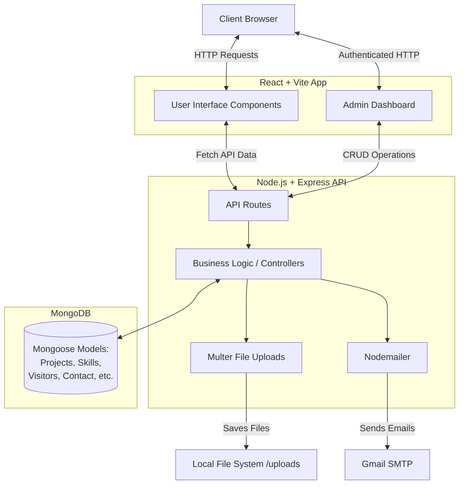

# Rahul's Dynamic Portfolio 🚀

A full-stack, customizable, and dynamic personal portfolio website built with the MERN stack (MongoDB, Express.js, React, Node.js). This portfolio is designed to showcase projects, skills, certificates, experiences, and more, all manageable through a secure, built-in Admin dashboard.

## 🌟 Key Features

- **Dynamic Content Management:** Add, edit, or delete Projects, Skills, Certificates, Experiences, and Timeline events directly from the Admin Panel.
- **Visitor Tracking:** Session-based visitor counter storing data in MongoDB to keep track of portfolio traffic without over-counting refreshes.
- **Contact Form & Email Notifications:** Visitors can send messages that are saved in the database and forwarded via Nodemailer.
- **Admin Dashboard:** Secure backend endpoints with an interface to handle all portfolio data, settings, and resume uploads.
- **Responsive & Modern UI:** Built with React, Tailwind CSS, and Lucide React icons, featuring a sleek, responsive design with dark mode support.
- **File Uploads:** Integrated with Multer to handle image and PDF uploads for certificates and projects.

## 🛠️ Tech Stack

### Frontend
- **Framework:** React 18 with TypeScript (bootstrapped with Vite)
- **Styling:** Tailwind CSS
- **Icons:** Lucide React
- **Build Tool:** Vite

### Backend
- **Server:** Node.js with Express.js
- **Database:** MongoDB (Mongoose ODM)
- **File Uploads:** Multer
- **Email Delivery:** Nodemailer
- **Security:** Express Rate Limit, CORS

## 🏗️ Architecture Diagram

Below is the high-level architecture diagram demonstrating how the client interacts with the backend and database.



## 🚀 Getting Started

### Prerequisites
- Node.js (v16+ recommended)
- MongoDB running locally or a MongoDB Atlas URI

### 1. Clone the Repository
```bash
git clone https://github.com/rahulmahaseth/Rahul-Portfolio.git
cd Rahul-Portfolio
```

### 2. Backend Setup
```bash
cd backend
npm install
```
Create a `.env` file in the `backend` directory (see `.env.example` if available):
```env
PORT=5001
MONGODB_URI=mongodb://127.0.0.1:27017/portfolio
EMAIL=your-email@gmail.com
APP_PASSWORD=your-app-password
```
Start the backend server:
```bash
node index.js
```

### 3. Frontend Setup
```bash
cd ../frontend
npm install
```
Start the frontend development server:
```bash
npm run dev
```
The application will usually be available at `http://localhost:5173`.

## 🔮 Future Enhancements
- **Authentication/Authorization:** Implement JWT-based login for the Admin panel to secure data endpoints.
- **Cloud Storage:** Migrate Multer uploads from the local filesystem to AWS S3 or Cloudinary.
- **Analytics Dashboard:** Build a comprehensive traffic and interactions analytics view inside the Admin Panel.

## 📄 License
This project is open-source and available under the MIT License.
