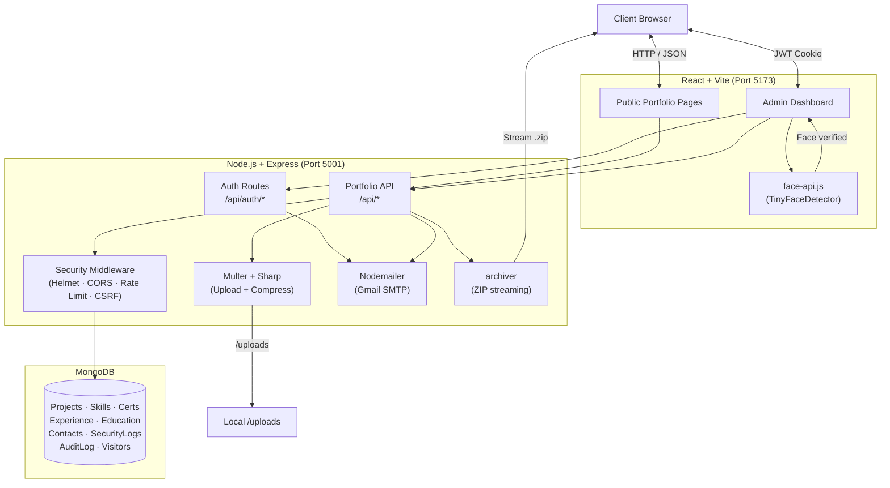

# Rahul's Dynamic Portfolio 🚀

A production-ready, full-stack personal portfolio website built with the **MERN stack** (MongoDB, Express.js, React 19, Node.js). Every section of the portfolio — projects, skills, certificates, experiences, education, achievements, and more — is fully dynamic and manageable through a secure, feature-rich Admin Dashboard with enterprise-grade security controls.

---

## 📋 Table of Contents

- [Key Features](#-key-features)
- [Tech Stack](#%EF%B8%8F-tech-stack)
- [Architecture](#%EF%B8%8F-architecture)
- [Project Structure](#-project-structure)
- [Getting Started](#-getting-started)
- [Environment Variables](#-environment-variables)
- [Admin Portal](#-admin-portal)
- [Security](#-security)
- [API Reference](#-api-reference)
- [License](#-license)

---

## 🌟 Key Features

### 🎨 Public Portfolio
| Feature | Details |
|---|---|
| **Animated Hero Section** | Type-animation headline, animated background, social links |
| **About Me** | Dynamic bio with profile image managed from admin |
| **Projects Gallery** | Multi-image carousel per project with swipe, arrows, thumbnails, and download |
| **Skills** | Categorised skill cards with icons |
| **Certificates** | Certificate gallery with full-screen viewer and download |
| **Experience & Education** | Vertical timeline with rich detail |
| **Achievements** | Awards and milestones showcase |
| **Contact Form** | Sends email via Nodemailer + stores message in MongoDB |
| **Visitor Counter** | Session-based tracking stored in MongoDB |
| **Dark Mode** | Full dark/light theme support |

### 🖼️ Project Gallery (Multi-Image)
- Each project supports a **cover image + up to 10 gallery images**
- Images stored in two versions: **optimized WebP** (fast loading) and **original high-res** (for download)
- Public view: responsive carousel with swipe, navigation arrows, thumbnail strip, and image counter
- **Download original** button on each image
- **"Download All Images (.zip)"** button streams all originals for that project as a single ZIP
- Admin: upload, preview, and remove individual gallery images per project

### 🔐 Admin Portal
- **Live face verification** before password entry (see [Security](#-security))
- Secure JWT cookie sessions with cross-domain support (Vercel/Render) and 15-minute inactivity timeout
- Full CRUD for: Projects, Skills, Certificates, Experiences, Education, Achievements, About, Resume, Settings
- Dynamic custom categories for Skills and Certificates
- Security Logs dashboard with login history snapshots
- Analytics overview
- Audit trail for every admin action

---

## 🛠️ Tech Stack

### Frontend
| Layer | Technology |
|---|---|
| Framework | React 19 with TypeScript |
| Build Tool | Vite 8 |
| Styling | Tailwind CSS 4 |
| Animations | Framer Motion |
| Icons | Lucide React, React Icons |
| HTTP | TanStack React Query |
| Routing | React Router DOM 7 |
| Face Detection | face-api.js (TinyFaceDetector, browser-only) |

### Backend
| Layer | Technology |
|---|---|
| Runtime | Node.js with Express.js |
| Database | MongoDB via Mongoose |
| Authentication | JWT (HttpOnly cookies) + bcrypt |
| File Uploads | Multer + Sharp (image compression + WebP) |
| ZIP Streaming | archiver |
| Email | Nodemailer (Gmail SMTP) |
| Security | Helmet, CORS, express-rate-limit, xss, cookie-parser, geoip-lite |
| Logging | morgan, express-useragent |
| Compression | compression |

---

## 🏗️ Architecture



---

## 📁 Project Structure

```
Rahul-Portfolio/
├── backend/
│   ├── models/
│   │   ├── Admin.js          # Admin credentials + lockout state
│   │   ├── SecurityLog.js    # Login attempts (IP, snapshot, geo, UA)
│   │   ├── AuditLog.js       # CRUD action audit trail
│   │   ├── Project.js        # Projects with image[] gallery array
│   │   ├── Skill.js
│   │   ├── Certificate.js
│   │   ├── Experience.js
│   │   ├── Education.js
│   │   ├── Achievement.js
│   │   ├── Contact.js
│   │   ├── Visitor.js
│   │   └── ...
│   ├── uploads/              # Stored image files (original + optimized)
│   └── index.js              # Main Express server
│
├── frontend/
│   ├── public/
│   │   └── models/           # face-api.js TinyFaceDetector model weights
│   ├── src/
│   │   ├── components/
│   │   │   ├── Admin/
│   │   │   │   ├── index.tsx         # Login + face gate + session
│   │   │   │   ├── layout/           # Sidebar, Header, AdminLayout
│   │   │   │   └── views/            # CRUD views per content type
│   │   │   ├── Projects.tsx          # Carousel + ZIP download
│   │   │   ├── Skills.tsx
│   │   │   ├── Certificate.tsx
│   │   │   └── ...
│   │   └── hooks/
│   │       └── useFaceValidation.ts  # Live face quality + liveness hook
│   └── vite.config.ts
│
└── README.md
```

---

## 🚀 Getting Started

### Prerequisites
- **Node.js** v18 or later
- **MongoDB** running locally or a [MongoDB Atlas](https://www.mongodb.com/atlas) URI
- A **Gmail account** with an [App Password](https://support.google.com/accounts/answer/185833) enabled

### 1. Clone the repository
```bash
git clone https://github.com/rahulmahaseth/Rahul-Portfolio.git
cd Rahul-Portfolio
```

### 2. Backend setup
```bash
cd backend
npm install
```

Create a `.env` file in `backend/`:
```env
PORT=5001
MONGODB_URI=mongodb://127.0.0.1:27017/portfolio
EMAIL=your-email@gmail.com
APP_PASSWORD=your-gmail-app-password
JWT_SECRET=your_64_char_random_secret_here
FRONTEND_URL=http://localhost:5173
NODE_ENV=development
```

Start the backend:
```bash
npm run dev       # development (nodemon)
# or
node index.js     # production
```

### 3. Frontend setup
```bash
cd ../frontend
npm install
npm run dev
```

The app will be available at **`http://localhost:5173`**.  
Admin portal: **`http://localhost:5173/admin`**

---

## 🔑 Environment Variables

| Variable | Required | Description |
|---|---|---|
| `PORT` | No | Backend port (default `5001`) |
| `MONGODB_URI` | ✅ | MongoDB connection string |
| `EMAIL` | ✅ | Gmail address for contact form |
| `APP_PASSWORD` | ✅ | Gmail App Password (not your account password) |
| `JWT_SECRET` | ✅ | Secret key for signing JWTs (min 32 chars) |
| `FRONTEND_URL` | ✅ | Allowed CORS origin (e.g. `https://yourdomain.com`) |
| `NODE_ENV` | No | `development` or `production` |

---

## 🔐 Admin Portal

Navigate to `/admin` to access the Admin Portal.

### Login Flow
1. Browser requests **Camera + Location** permissions
2. **Live face detection** runs automatically (see [Security](#-security))
3. Password field **slides in** once a live face passes all quality checks
4. Enter the admin password and click **Login**
5. Session lasts until logout or **15 minutes of inactivity**

### Default Admin Password
On first run with an empty database, the default password is set automatically to:
```
Raj Mahaseth@123
```
Change it immediately from **Admin → Settings**.

### Sections Managed
| Section | Capabilities |
|---|---|
| Dashboard | Overview stats, quick links |
| Projects | Create / edit / delete projects with multi-image gallery upload |
| Skills | Add / remove / reorder skills by category |
| Certificates | Upload certificate images with title, issuer, date |
| Experience | Work history timeline |
| Education | Academic timeline |
| Achievements | Awards and recognitions |
| About | Bio text and profile photo |
| Resume | Upload and manage downloadable resume PDF |
| Contacts | View and delete contact form submissions |
| Settings | Change admin password |
| Analytics | Visitor and traffic overview |
| Security Logs | Login history with IP, geo, device, and webcam snapshot |

---

## 🛡️ Security

### OWASP Hardening
| Protection | Implementation |
|---|---|
| Helmet CSP | Strict Content-Security-Policy, X-Frame-Options, nosniff |
| CORS Whitelist | Only `FRONTEND_URL` and localhost allowed |
| Rate Limiting | Login: 5 attempts → 15-min lockout. API: express-rate-limit |
| XSS Prevention | `xss` library sanitizes all user input recursively |
| NoSQL Injection | Keys starting with `$` or containing `.` are stripped |
| HPP Protection | Duplicate query-string keys collapsed to last value |
| Secure Cookies | JWT in `HttpOnly; Secure; SameSite=Strict` cookies |
| CSRF Token | CSRF token required on all state-changing requests |
| Magic-Byte Validation | Upload MIME checked against actual file bytes, not just extension |
| UUID Filenames | Uploaded files renamed with UUIDs to prevent path traversal |
| File Size Limit | Max 10 MB per upload |
| Error Sanitization | Stack traces never returned to clients in production |
| X-Powered-By | Disabled to reduce fingerprinting |
| HTTPS Redirect | Enforced in `NODE_ENV=production` |
| HSTS | `Strict-Transport-Security` header in production |

### Live Face Verification (Login Gate)
The Admin login uses **face-api.js** (runs entirely in the browser — no images sent to any server) to verify a live human face before the password field is shown.

**5-stage pipeline (runs every 350 ms):**

```
Stage 1 → Frozen frame?         pixel diff < threshold → "frozen"
Stage 2 → Global brightness     < 18 or > 244 lum      → "too_dark" / "overexposed"
Stage 3 → Global texture        std-dev < 3             → solid screen / paper / wall
Stage 4 → TinyFaceDetector      0 faces                 → "no_face"
                                 2+ faces                → "multiple"
                                 confidence < 55%        → "no_face"
Stage 5 → Face-region checks    face lum out of range   → "too_dark" / "overexposed"
                                 std-dev < 5             → "blurry" / obstructed
                                 std < 10 + spread < 8  → "spoof" (photo/screen)
```

**Rejected scenarios:** black screen, white screen, solid-colour paper, printed photo, phone/tablet screen showing a face, mannequin, covered camera, clothing-only view, wall, multiple people, blurry or frozen camera.

**Fallback:** If the ML models fail to download within 10 seconds, the system enters degraded mode — the camera is still verified as active and the login proceeds.

### Security Logs
Every login attempt is logged with:
- **Real client IP** (correctly parsed from `X-Forwarded-For`, supports proxies and Cloudflare)
- Browser, OS, device type (via `express-useragent`)
- Geolocation (country, region, city via `geoip-lite`)
- Webcam snapshot at time of login
- Success / failure status

Every admin CRUD action is recorded in the **Audit Log** with entity type, entity ID, and timestamp.

---

## 📡 API Reference

### Authentication
| Method | Endpoint | Description |
|---|---|---|
| `GET` | `/api/auth/csrf-token` | Get CSRF token |
| `POST` | `/api/auth/login` | Login (password + optional snapshot) |
| `POST` | `/api/auth/logout` | Invalidate session |
| `GET` | `/api/auth/check` | Check active session |

### Portfolio Data (Public)
| Method | Endpoint | Description |
|---|---|---|
| `GET` | `/api/portfolio` | All public data in one request |

### Projects
| Method | Endpoint | Description |
|---|---|---|
| `GET` | `/api/projects` | List all projects |
| `POST` | `/api/projects` | Create project (with cover + gallery images) |
| `PUT` | `/api/projects/:id` | Update project |
| `DELETE` | `/api/projects/:id` | Delete project |
| `GET` | `/api/projects/:id/download-images` | Stream ZIP of all originals |

### Other Resources (Skills, Certs, Experience, Education, Achievements, Contacts, Settings…)
All follow the same `GET / POST / PUT / DELETE` pattern under `/api/<resource>`.

---

## 🔮 Planned Enhancements

- [ ] **Cloud Storage** — Migrate `/uploads` to AWS S3 or Cloudinary
- [ ] **2FA** — TOTP-based two-factor authentication for admin login
- [ ] **PWA** — Progressive Web App support with offline caching
- [ ] **i18n** — Multilingual portfolio support
- [ ] **Blog Module** — Markdown-powered blog section with CMS

---

## 📄 License

This project is open-source and available under the **MIT License**.

---

<div align="center">

Made with ❤️ by **Rahul Mahaseth**

</div>
